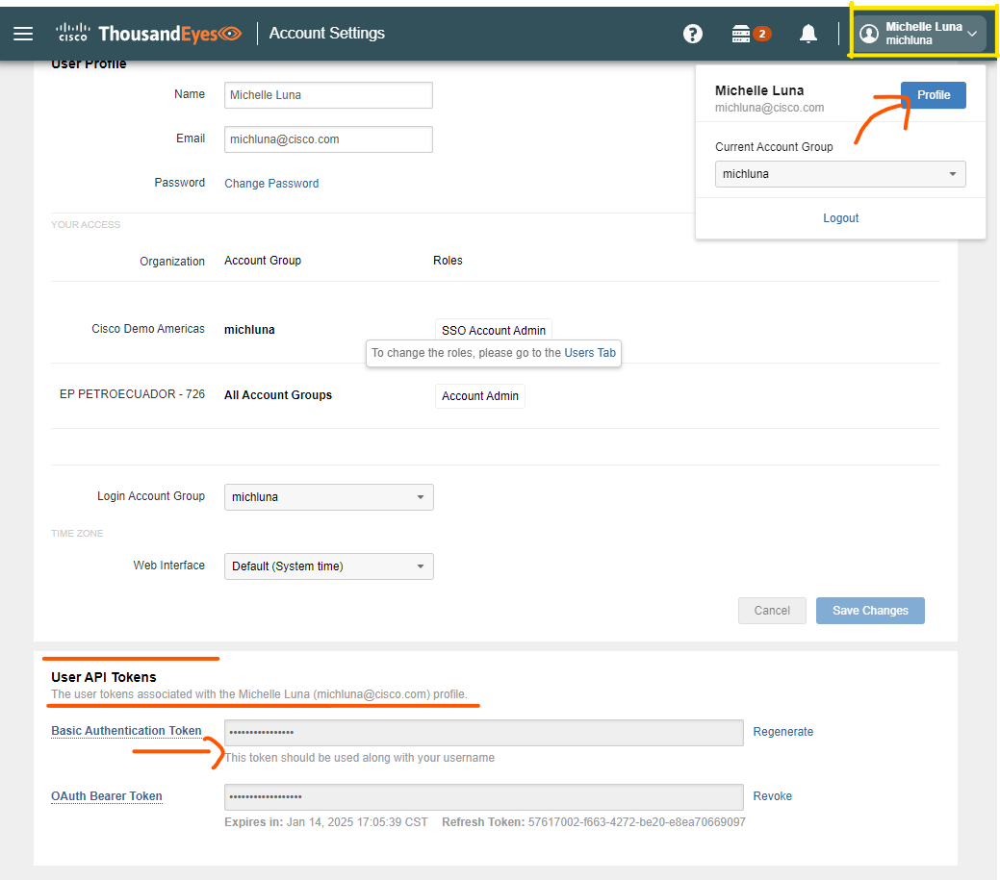
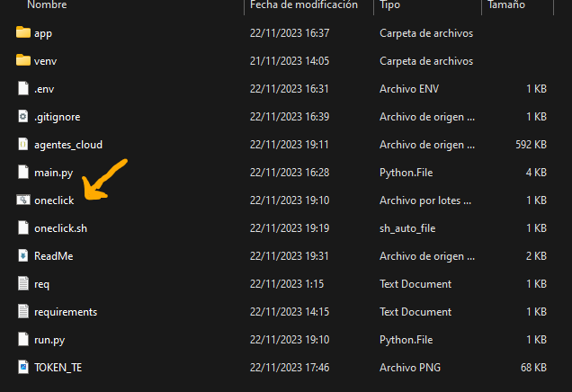

# OneClickTest Project

## Descripción
**OneClickTest** es una herramienta diseñada para facilitar la creación de pruebas HTTP en **ThousandEyes**. Este proyecto permite a los usuarios configurar y ejecutar pruebas HTTP hacia múltiples objetivos (`targets`) con un intervalo predeterminado de **5 minutos**. Además, ofrece la opción de integrar estas pruebas en un grupo etiquetado como **"Dragonfly"**, proporcionando acceso a herramientas avanzadas de análisis.

## Características Clave
- Creación rápida de pruebas HTTP en ThousandEyes.
- Integración con el grupo "Dragonfly" para análisis avanzado.
- Configuración sencilla de variables de entorno para autenticación.
- Scripts de inicio fácil para Windows y macOS.

## Prerrequisitos
- Python 3.x
- Credenciales de ThousandEyes (email y API token)


## Obtener un Token de Autenticación
Para obtener tu token de autenticación de ThousandEyes:
1. Accede al dashboard de **"Profile"** en la consola de ThousandEyes.
2. Localiza y copia tu API Token. Se recomienda usar el token básico para la autenticación.



## Configuración de Variables de Entorno
Configura las variables de entorno necesarias para la autenticación:

1. Crea un archivo `.env` en el directorio raíz del proyecto.
2. Añade las siguientes variables, reemplazando `your_email` y `your_auth_token` con tus credenciales:

    ```plaintext
    EMAIL=your_email
    AUTH_TOKEN=your_auth_token
    ```

## Instalación de Dependencias
Instala las dependencias necesarias para ejecutar la aplicación:

```bash
pip install requirements.txt
```


## Corre el ejecutable:
### Windows
Ejecuta el archivo oneclick.bat para iniciar la aplicación. Puedes hacerlo de dos formas:

- Desde la línea de comandos:
```bash
oneclick.bat
```
- Haciendo doble clic directamente en el archivo oneclick.bat.



### macOS
Para macOS, sigue estos pasos para ejecutar oneclick.sh:
1. Otorga permisos de ejecución al script:
```bash
chmod +x oneclick.sh
```

2. Ejecuta el archivo:
```bash
./oneclick.sh
```

## Las siguientes veces solo deberas abrir la consola y escribir oneclick para llamar al programa :D