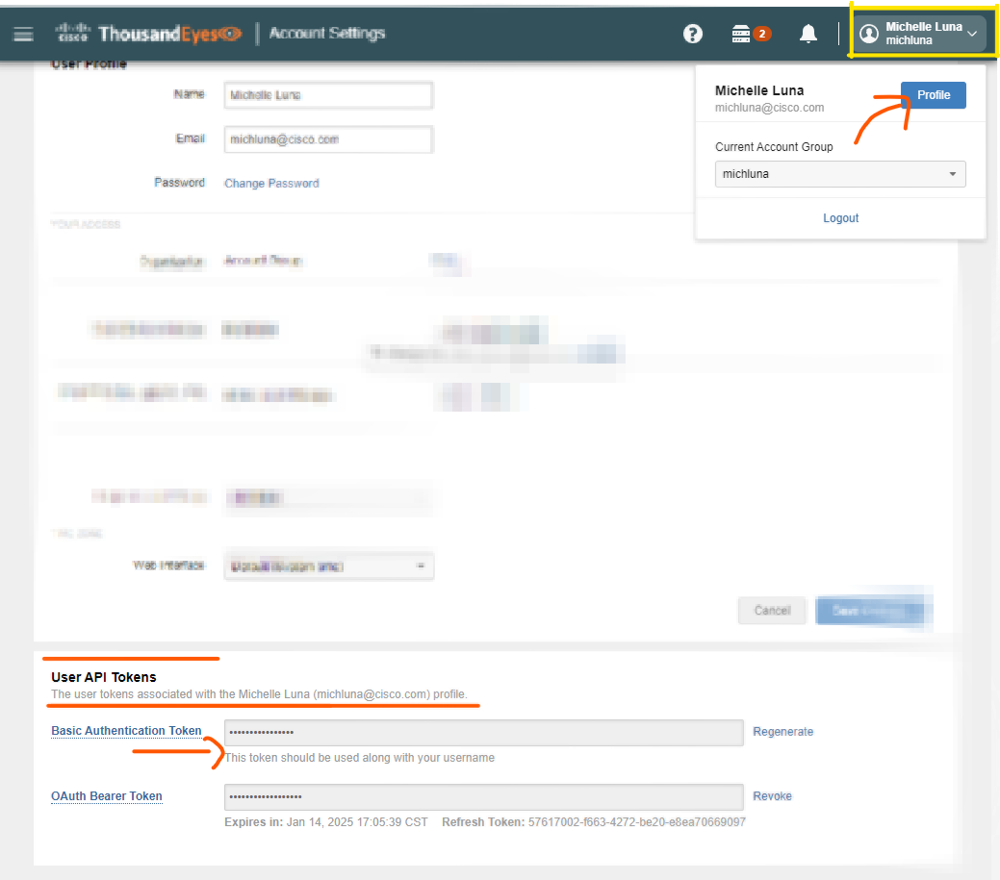
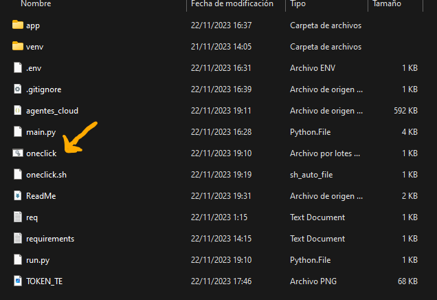
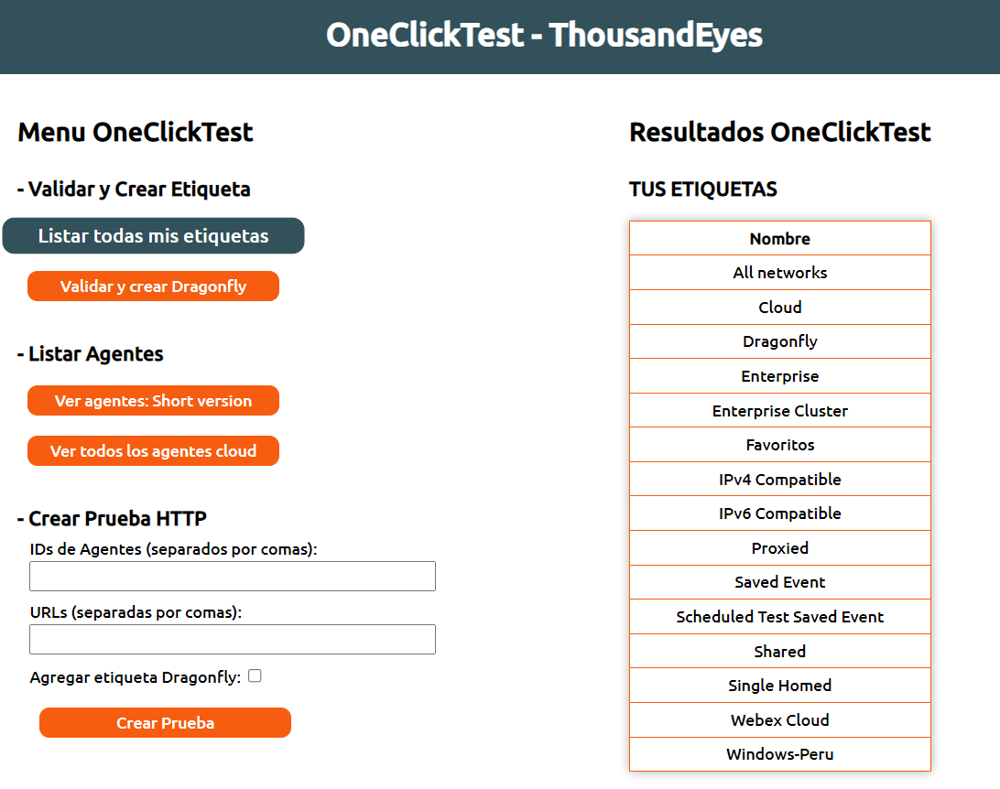
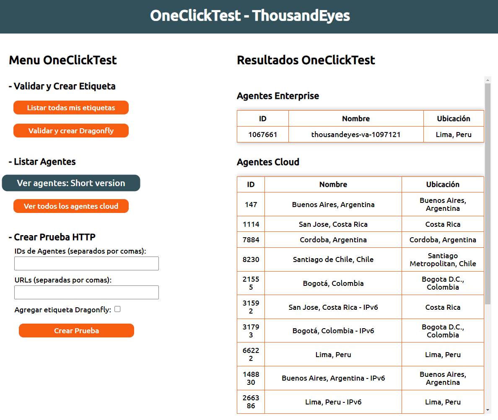
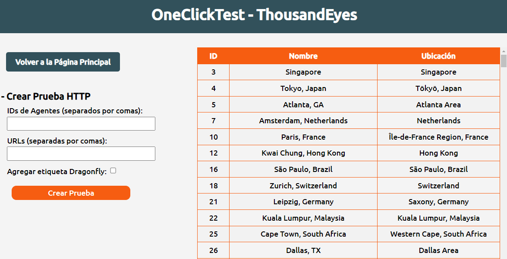
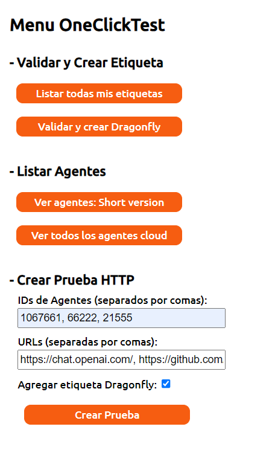
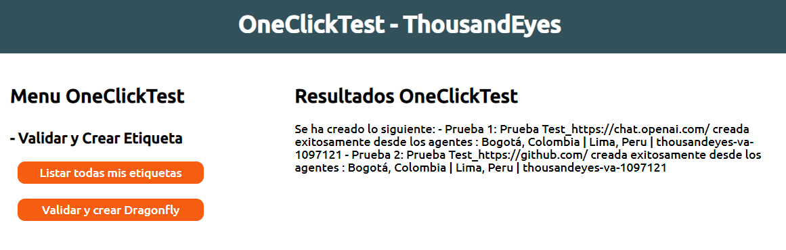
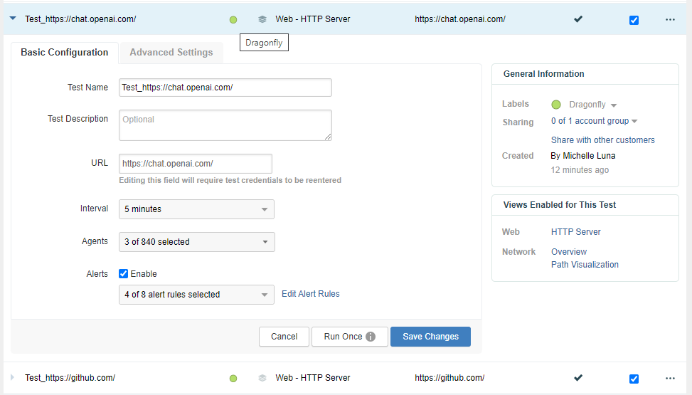

# OneClickTest Project

## Descripción
**OneClickTest** es una herramienta diseñada para facilitar la creación de pruebas HTTP en **ThousandEyes**. Este proyecto permite a los usuarios configurar y ejecutar pruebas HTTP hacia múltiples objetivos (`targets`) con un intervalo predeterminado de **5 minutos**. Además, ofrece la opción de integrar estas pruebas en un grupo etiquetado como **"Dragonfly"**, proporcionando acceso a herramientas avanzadas de análisis.

## Características Clave
- Creación rápida de pruebas HTTP en ThousandEyes.
- Integración con el grupo "Dragonfly" para análisis avanzado.
- Configuración sencilla de variables de entorno para autenticación.
- Scripts de inicio fácil para Windows y macOS.

## Prerrequisitos
- Python 3.x
- Credenciales de ThousandEyes (email y API token)

## Pasos para usar OneClickTest
### Clona el repositorio
Usa los siguientes comandos para clonar el repositorio en tu local:

```bash
git clone https://github.com/milunadev/TE-DragonFly
cd TE-DragonFly
```

### Obtener un Token de Autenticación
Para obtener tu token de autenticación de ThousandEyes:
1. Accede al dashboard de **"Profile"** en la consola de ThousandEyes.
2. Localiza y copia tu API Token. Se recomienda usar el token básico para la autenticación.

<p align="center">
    
</p>


### Configuración de Variables de Entorno
Configura las variables de entorno necesarias para la autenticación:

1. Crea un archivo `.env` en el directorio raíz del proyecto.

```bash
touch .env
```

2. En el archivo .env añade las siguientes variables, reemplazando `your_email` y `your_auth_token` con tus credenciales:

    ```plaintext
    EMAIL=your_email
    AUTH_TOKEN=your_auth_token
    ```

### Instalación de Dependencias
Instala las dependencias necesarias para ejecutar la aplicación:

```bash
pip install -r requirements.txt
```


### Corre el ejecutable:
#### Windows
Ejecuta el archivo oneclick.bat para iniciar la aplicación. Puedes hacerlo de dos formas:

- Desde la línea de comandos:
```bash
oneclick.bat
```
- Haciendo doble clic directamente en el archivo oneclick.bat.

<p align="center">
    
</p>


#### macOS
Para macOS, sigue estos pasos para ejecutar oneclick.sh:
1. Otorga permisos de ejecución al script:
```bash
chmod +x oneclick.sh
```

2. Ejecuta el archivo:
```bash
./oneclick.sh
```

#### Ejecución manual
Ingresa al directorio raiz, donde se encuentra 'run.py' y ejecutalo con:
```bash
python run.py
```

## Las siguientes veces solo deberas abrir la consola y escribir oneclick para llamar al programa :D

## FUNCIONES DE ONE CLICK TEST v0.1
Por ahora OneClickTest tiene las siguientes funciones:
1. Lista todas tus etiquetas de ThousandEyes
2. Valida y crea la etiqueta 'Dragonfly', necesaria para acceder a esta herramienta de analisis poderosa, pronto disponible.
!<p align="center">
    
</p>

3. Lista tus agentes Enterprise y los principales agentes cloud de Sudamerica, se muestra el **Agent_id** que usaras para crear tus pruebas.
<p align="center">
    
</p>

4. Lista todos los agentes Cloud disponibles y los **Agent_id**.

<p align="center">
    
</p>


5. CREA TUS PRUEBAS! Solo debes poner el **Agent_id** o varios separados por comas, también puees poner los dominios separados por comas. Adicionalmente puedes etiquetarlas en tu grupo Dragonfly marcando la casilla. 

 - ⏳ La API de TE para crear pruebas suele tardar de 1-2 minutos por prueba. Asi que puedes ocuparte o ir por un cafecito ☕ y volver para revisar que se hayan creado correctamente, el mensaje aparecerá en pantalla.

- Aqui un ejemplo: He creado 2 pruebas, una hacia OpenAI y otra hacia GitHub. Ambas desde 3 agentes (Lima, Bogota y mi agente enterprise).
<p align="center">
    
</p>

6.  Asi se ve el resultado, despues de unos minutos de espera:

<p align="center">
    
</p>

🎉 Así se ve en el dashboard, mis dos pruebas HTTP con la etiqueta Dragonfly 🎉.

<p align="center">
    
</p>